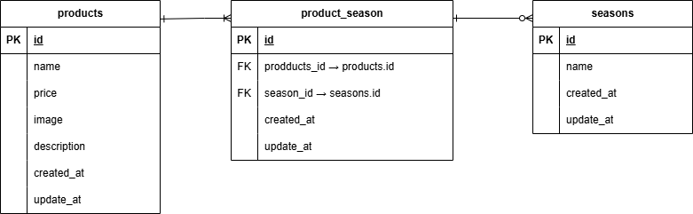

# coachtechもぎたて

## 環境構築

### Dockerビルド
- laravelディレクトリ以下に    laravel-docker-template.gitをクローンする

```
$ git clone git@github.com:Estra-Coachtech/laravel-docker-template.git

```
- リポジトリ名をmogitateに変更

```
$ mv laravel-docker-template mogitate

```

- リモートリポジトリの作成及び、URLの取得
  (カレントディレクトリはlaravelディレクトリ)

```
$ cd mogitate
$ git remote set-url origin git@github.com:renayashiki/mogitate.git

$ git remote -v

```
- Dockerの設定
```
$ docker-compose up -d --build
$ code .

```

### Laravel 環境構築

- PHPコンテナへ移動しパッケージをインストールし、srcディレクトリ以下にvendorディレクトリを作成
```
$ docker-compose exec php bash
(PHPコンテナ内で)
# composer install 

```

- データベースに接続するためにenvファイルを作成

```
# cp .env.example .env
# exit

```

- .envファイルの11行目以降を以下のように修正し
　　docker-compose.ymlで作成したデータベース　　名、ユーザ名、パスワードを.envファイルに
　　記述する。

```
// 前略

DB_CONNECTION=mysql
- DB_HOST=127.0.0.1
+ DB_HOST=mysql

DB_PORT=3306
- DB_DATABASE=laravel
- DB_USERNAME=root
- DB_PASSWORD=
+ DB_DATABASE=laravel_db
+ DB_USERNAME=laravel_user
+ DB_PASSWORD=laravel_pass

// 後略

```
- アプリケーションを実行できるようにコマンドを実行する
```
# php artisan key:generate

```

- モデルとマイグレーションファイルを作成しコードを記述
```
#  php artisan make:model Product --migration

# php artisan make:model Season --migration

#  php artisan make:migration create_product_season_table

```

- シーダーファイルを作成しコード記述後、マイグレーションとシーディングを一括実施
```
# php artisan make:seeder ProductSeeder

# php artisan make:seeder SeasonSeeder

# php artisan migrate:fresh --seed

```

## 開発環境
- phpMyAdmin: [http://localhost/admin](http://localhost/admin)

- 商品一覧画面:　[http://localhost/products](http://localhost/products)

- 商品登録画面:　[http://localhost/products/register](http://localhost/products/register)


## ER図



